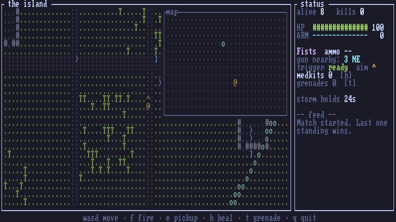

# ascii-royale

**A battle royale you play in your terminal.** Pure text, peer-to-peer over
[iroh](https://iroh.computer) — no game server, no accounts, one binary.

Up to 16 combatants drop onto a procedurally generated ASCII island. Scavenge
weapons, dodge bullets you can actually see coming, and outrun the storm.
Last one standing wins. Bots fill empty slots, so it's playable solo too.



*An actual match (sped up ~2x): the drop and first loot, a mid-game scrap,
and the finale as the storm swallows the island. Rendered headlessly through
the real game code — see `examples/capture_gif.rs`.*

<details>
<summary>Static frame, for the full glyph detail</summary>

```text
┌ the island ────────────────────────────────────────────────────────────┐┌ status ────────────────┐
│.........................................o........~~~~~~~~..........~~~~││alive 8   kills 2       │
│.........................................o........~~~~~~~~~.........~~~~││                        │
│.........................................oo.......~~~~~~~~~........~~~~~││HP  ########------  64  │
│..........................................o.......~~~~~~~~~~......~~~~~~││ARM ####----------  31  │
│..........................................o........~~~~~~~~~~~....~~~~~~││                        │
│..........................................o........~~~~~~~~~~~...~~~~~~~││Rifle  ammo 23          │
│......................................####oo########..~~~..~~~~~.~~~~~~~││trigger ....  aim v     │
│......................................#,,,,o,,,,,,,#.........~~~~~~~~~~~││medkits 0  [h]          │
│...........=.............)...........]#,,,)o,,,,,,,#.........~~~~...~~~~││                        │
│........###,###.......................#,,,)oo,,,,,,#..........~~~~.~~~~~││storm holds 9s          │
│........#),+,,#.......................#,,,),o,,,,,,#...........~~~~~~~~~││                        │
│....+...#,,,,,#+......................#,,,,,o,,,,,,#...........~~~~~~~~~││-- feed --              │
│........#,,,,,#.......................#######)######...........~~~~~~~~~││Zone closing: 20s       │
│.....@..##,####...@..........................o...................~~~~...││bot3 eliminated bot5    │
│.....|.......................................oo..................~~~....││(Shotgun)               │
│.....|........................................o.........................││                        │
│.....|........................................oo........................││                        │
│.....|.......................+.................o........................││                        │
│...............................................oo.......................││                        │
│........................................T..T...To..T....................││                        │
│.........................................T....TTToTT....................││                        │
│:::::::::::::::::::::::::::::::::::::::::::::::::oo:::::::::::::::::::::││                        │
│::::::::::::::::::::::::::::::::::::::::::::::::::o:::::::::::::::::::::││                        │
│......................]................T........TToo....................││                        │
│........................................TTT......T.oo...................││                        │
│.............+.........................T............o...................││                        │
└────────────────────────────────────────────────────────────────────────┘└────────────────────────┘
             wasd/arrows move+aim · f / space fire · e / g pickup · h / m heal · q quit
```

*A rifle tracer (`|`) streaking away from your `@`, an enemy `@` closing in,
loot scattered through a building, the `o` ring marking where the storm
settles next, and water/forest/road terrain. In your terminal it's all in
color, with 8-bit sound.*

</details>

## Features

- **Peer-to-peer multiplayer** — one player hosts, friends join with a short
  ticket string. iroh handles NAT holepunching; connections are direct QUIC
  between machines. No server to run, nothing to sign up for.
- **Real projectiles** — bullets fly cell by cell, leave tracer trails, and
  can be sidestepped. Walls and trees block shots; water blocks you.
- **Auto-aim that keeps the skill** — fire snaps to the nearest enemy lined
  up with you in any direction. Getting lined up (and not *being* lined up)
  is the game.
- **The storm** — a shrinking circle through 7 escalating phases, with the
  next safe ring drawn on the map.
- **Six weapons** plus armor vests and medkits; kills drop everything.
- **Bots** with a survival brain (flee storm > fight > loot > wander), so a
  lobby of two is still a match of sixteen.
- **Procedural 8-bit sound** — synthesized square-wave chiptune effects, no
  audio files. Mute with `M`. Silent automatically over SSH.
- **Rebindable keys** with a built-in config screen, saved to a dotfile.
- **Fog of war for free** — snapshots only contain what's near you (~1 KB,
  10/sec), so it's light enough to play over a phone hotspot.

## Install

Needs [Rust](https://rustup.rs) 1.91+.

```sh
git clone https://github.com/chad/ascii-royale
cd ascii-royale
cargo install --path .
```

(or `cargo build --release` and grab `target/release/ascii-royale`)

## Play

**Host a match** — you play too; the lobby shows a ticket to share:

```sh
ascii-royale host                    # name defaults to $USER, 7 bots
ascii-royale host --bots 3 --name chad
```

```text
┌ ascii-royale · lobby ────────────────────────────────────────────────┐
│                          _ _                        _                │
│            __ _ ___  ___(_|_)  _ __ ___  _   _  __ _| | ___          │
│           / _` / __|/ __| | | | '__/ _ \| | | |/ _` | |/ _ \         │
│          | (_| \__ \ (__| | | | | | (_) | |_| | (_| | |  __/         │
│           \__,_|___/\___|_|_| |_|  \___/ \__, |\__,_|_|\___|         │
│                                          |___/                       │
│                                                                      │
│                         ticket  abc123ticket                         │
│             friends join with: ascii-royale join <ticket>            │
│                                                                      │
│                            combatants (3)                            │
│                                 @ chad                               │
│                               @ wanderer                             │
│                                  @ kex                               │
│                                                                      │
│     [enter] drop in (bots fill empty slots) · [k] keys · [q] quit    │
└──────────────────────────────────────────────────────────────────────┘
```

**Join a match:**

```sh
ascii-royale join <ticket>
```

**Play offline against bots:**

```sh
ascii-royale solo --bots 9
```

## Controls

| key | action |
|---|---|
| `wasd` / arrows | move — this also sets your aim |
| `f` / space | fire — auto-aims at the nearest lined-up enemy, else along your `^ v < >` crosshair; pressing during cooldown fires the moment the weapon is ready |
| `e` / `g` | pick up the item under you |
| `h` / `m` | use a medkit (+40 HP) |
| `M` | mute / unmute sound |
| `k` | key bindings screen (in the lobby) |
| Enter | start the match (host, in lobby) |
| `q` / Esc | quit |

### Rebinding keys

Press `k` in the lobby. Pick an action, press Enter, press the new key.
Prefer `sdfc` to `wasd`? Bind each one — a key you assign is automatically
stolen from whatever it used to do, and arrows always work as a fallback.

```text
┌ key bindings (arrows always move) ───────┐
│                                          │
│  move up    w                            │
│> move down  s                            │
│  move left  a                            │
│  move right d                            │
│  fire       f / space                    │
│  pick up    e / g                        │
│  heal       h / m                        │
│  mute       M                            │
│                                          │
│up/down select · enter rebind · r reset · │
└──────────────────────────────────────────┘
```

Bindings persist in `~/.config/ascii-royale/keys.conf`, a plain text file
you can also edit by hand (`fire = j space`). `r` resets the defaults.

## How to win

- **Get a gun first.** You spawn with fists. Buildings (`#` boxes) hold most
  of the loot — walk onto a `)` and press `e`. Guns come loaded; `=` ammo
  packs keep them fed. The sidebar points at the nearest gun while you're
  unarmed.
- **To hit someone they must share your row or column** when you pull the
  trigger. Auto-aim picks the direction; your job is positioning.
- Bullets draw tracers (`-` `|`) and a `*` where they land. You hear nearby
  impacts — louder means closer.
- Loot: `)` weapon · `=` ammo · `+` medkit · `]` vest (absorbs half of each
  hit until it breaks).
- The blue `%` wash is the storm: damage every half-second, ignores armor,
  escalates each phase. The `o` ring is the next safe circle.
- Weapons, roughly: fists < pistol < shotgun < SMG < rifle < sniper. The
  sniper hits like a truck but fires once per 1.5 s; shotgun and sniper
  burn 2 ammo per shot.
- Dying drops all your gear where you fall. Placement is decided the moment
  you die.

## Run an arena (zero-install play over SSH)

`ascii-royale serve` runs a headless arena: no local player, the match
auto-starts ~20 s after the first human enters the lobby, bots fill the
seats, and the lobby reopens after every match. Players arriving mid-match
are queued for the next island, and the join ticket lands in a file:

```sh
ascii-royale serve --bots 7 --ticket-file /run/royale/ticket
```

Pair it with a locked-down SSH guest account and anyone with a terminal can
play with **zero installation** — `ssh play@your-arena` drops them straight
into the name prompt. `deploy/` has the complete recipe:

- `royale-launcher` — forced command: pick a call sign, join, play again
- `royale-arena.service` — systemd unit for the arena process
- `sshd-play.conf` — guest user: no shell, no forwarding, empty password
  (with OpenSSH this even skips the password prompt entirely)
- `sshd-hardening.conf` — everything else stays key-only

Point your DNS at a host with a public SSH port and you're done. (The
host needs inbound TCP — a plain VPS works; some sandboxes don't expose
one, in which case you need a real tunnel, not a shared unauthenticated
relay: those hand out ports first-come, so a published port can silently
end up pointing at someone else's machine.)

## How it works

```text
host process                                   joiners
┌───────────────────────────────┐
│ authoritative sim @ 10 Hz     │   QUIC (iroh, holepunched)
│  inputs → move/fire/loot      │◄──── inputs ───────  terminal client
│  bullets, storm, bots, deaths │───── snapshots ───►  (ratatui)
│  + the host's own terminal    │
└───────────────────────────────┘
```

One player hosts; their process runs the only simulation. Clients send
discrete inputs and receive personalized, visibility-filtered snapshots —
which is also the fog of war. The host's own player goes through the same
protocol over an in-process channel, so `solo` is just a host without a
listener. The ticket is the host's iroh public key.

Honest caveat: there's no central *game* server, but iroh's default
discovery and relay infrastructure (run by [n0](https://n0.computer)) is
used to find and reach the host; traffic falls back to a relay only when
holepunching fails. And the match dies if the host quits — host migration
is on the wishlist.

Sound never touches the network: effects are synthesized client-side
(square waves + noise) and triggered by diffing consecutive snapshots.

## Development

```sh
cargo test                                          # sim, protocol, render, binding tests
cargo test --test e2e -- --ignored                  # real two-peer match over iroh
cargo test --lib preview -- --ignored --nocapture   # print rendered frames
cargo test --lib audible_demo -- --ignored --nocapture  # hear every sound effect
cargo run --example capture_gif                     # re-render assets/gameplay.gif
```

The gameplay GIF is generated, not screen-recorded: `capture_gif` simulates a
deterministic bot match twice with the same seed (pass one learns who wins,
pass two records from the winner's POV), draws each tick through the real
ratatui render path into a headless buffer, rasterizes cells with an 8×8
bitmap font, and encodes a frame-differenced GIF.

The simulation is fully headless: `full_bot_match_produces_a_winner` runs an
entire 8-bot match to completion in milliseconds. See `DESIGN.md` for the
design document and `PLAN.md` for implementation status.

## License

MIT
